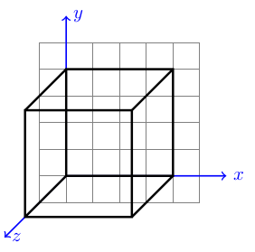
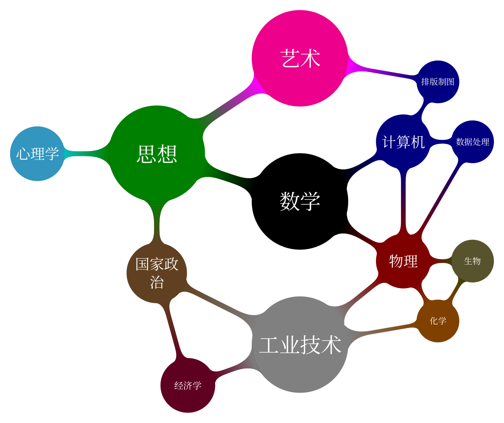
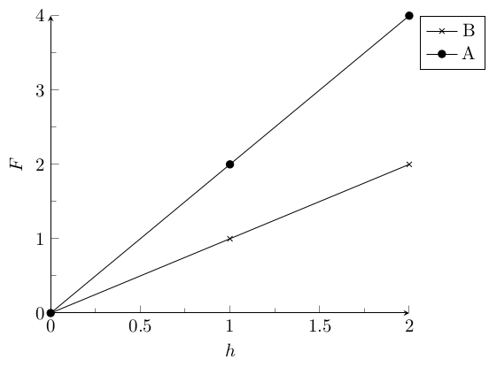
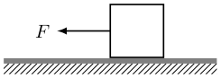
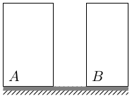

## tikz_gallery

### 3d\3dtest1

[source code](gallery/3d/3dtest1.tex)

---

### 3d\3dtest2

[source code](gallery/3d/3dtest2.tex)

---

### 3d\test3d

[source code](gallery/3d/test3d.tex)

---

### balance\example

[source code](gallery/balance/example.tex)

---

### basic\example

[source code](gallery/basic/example.tex)

---

### basic\example2

[source code](gallery/basic/example2.tex)

---

### basic\example3

[source code](gallery/basic/example3.tex)

---

### basic\example4

[source code](gallery/basic/example4.tex)

---

### basic\example5

[source code](gallery/basic/example5.tex)

---

### basic\example6

[source code](gallery/basic/example6.tex)

---

### basic\example7

[source code](gallery/basic/example7.tex)

---

### circuit\example

[source code](gallery/circuit/example.tex)

---

### circuit\example2

[source code](gallery/circuit/example2.tex)

---

### circuit\example3

[source code](gallery/circuit/example3.tex)

---

### clock\clock

[source code](gallery/clock/clock.tex)

---

### clock\example

[source code](gallery/clock/example.tex)

---

### convex_lens\example

[source code](gallery/convex_lens/example.tex)

---

### falling_body\example

[source code](gallery/falling_body/example.tex)

---

### Galileo\example

[source code](gallery/Galileo/example.tex)

---

### Galileo\example2

[source code](gallery/Galileo/example2.tex)

---

### gravity\example

[source code](gallery/gravity/example.tex)

---

### mandala\mandala

[source code](gallery/mandala/mandala.tex)

---

### measuring_cylinder\example

[source code](gallery/measuring_cylinder/example.tex)

---

### measuring_cylinder\example2

[source code](gallery/measuring_cylinder/example2.tex)

---

### measuring_cylinder\example3

[source code](gallery/measuring_cylinder/example3.tex)

---

### mindmap\example

[source code](gallery/mindmap/example.tex)

---

### mindmap\example2

[source code](gallery/mindmap/example2.tex)

---

### mindmap\example4

[source code](gallery/mindmap/example4.tex)

---

### mindmap\mindmap_3

[source code](gallery/mindmap/mindmap_3.tex)

---

### mindmap\simple

[source code](gallery/mindmap/simple.tex)

---

### other\example

[source code](gallery/other/example.tex)

---

### other\example2

[source code](gallery/other/example2.tex)

---

### other\example3

[source code](gallery/other/example3.tex)

---

### other\example4

[source code](gallery/other/example4.tex)

---

### patterns\example_one

[source code](gallery/patterns/example_one.tex)

---

### patterns\example_two

[source code](gallery/patterns/example_two.tex)

---

### pgfplots\example

[source code](gallery/pgfplots/example.tex)

---

### pgfplots\example2

[source code](gallery/pgfplots/example2.tex)

---

### pgfplots\example3

[source code](gallery/pgfplots/example3.tex)

---

### pgfplots\example_one

[source code](gallery/pgfplots/example_one.tex)

---

### polygon\example

[source code](gallery/polygon/example.tex)

---

### polygon\example2

[source code](gallery/polygon/example2.tex)

---

### polygon\example3

[source code](gallery/polygon/example3.tex)

---

### random_walk\example

[source code](gallery/random_walk/example.tex)

---

### refraction\refraction

[source code](gallery/refraction/refraction.tex)

---

### ruler\example

[source code](gallery/ruler/example.tex)

---

### spring\example

[source code](gallery/spring/example.tex)

---

### spring\example2

[source code](gallery/spring/example2.tex)

---

### spring\example3

[source code](gallery/spring/example3.tex)

---

### thermometer\example

[source code](gallery/thermometer/example.tex)

---

### venn_diagram\example

[source code](gallery/venn_diagram/example.tex)

---

