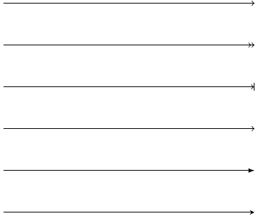

# TIKZ制图简要教程

**请查看更多[tikz制图样例](GALLERY.md) **。

## 前言

tikz制图详解

## beginning

### 准备工作

这里所谓的准备工作当然指你的 LaTeX 编译环境配置好，然后tikz宏包的加载是必须的。

tikz有两种使用方法，一种命令式的，一种环境式的。命令式用tikz命令包围起来，命令式是inline模式的。环境式用tikzpicture环境命令包围起来。如下所示：

```latex
\tikz{\draw (1,0) -- (0,1) -- (-1,0) -- (0,-1) -- cycle;}

\begin{tikzpicture}
\draw (1,0) -- (0,1) -- (-1,0) -- (0,-1) -- cycle;
\end{tikzpicture}
```

inline模式对于注重内容的用户来说会用的较少，有时可能自己建的某些宏包底层会使用到tikz命令。但不管是注重华丽表现效果的用户还是注重内容的用户，总是会有需求需要某一整张图片来表达某些内容，而tikz以及其他基于tikz的宏包在命令行绘图这个领域可以说是很优秀的，这绝不是那些只能绘制基本的线条或者其他的形状的图形包所能比的。下面将主要使用tikzpicture环境命令模式。


### 使用standalone类

用tikz绘制某个单独的图片而不是一般的A4页面推荐使用 **standalone** 类。如下所示:

```tex
\documentclass[tikz,border=2pt]{standalone}
\begin{document}
\begin{tikzpicture}
\draw[step=1,color=gray!40] (-2,-2) grid (2,2);
\draw[->] (-3,0) -- (3,0);
\draw[->] (0,-3) -- (0,3);
\draw (0,0) circle (1); 
\end{tikzpicture}
\end{document}
```


### 画网格

画网格主要用于辅助绘图，其中 `help lines` 是个不错的参数设置。此外 `step` 用来控制网格之间的间距，可以color来设置网格的颜色，不过一般没那个必要。然后接下来第一个坐标点是网格的左底点，第二个坐标点是网格的右定点。

    \begin{tikzpicture}
    \draw[help lines] ( -5,-5 ) grid ( 5, 5);
    \end{tikzpicture}

我们看到tikz的每一条命令最后都要跟一个分号“;”。

### 画直线

    \begin{tikzpicture}
    \draw[help lines] ( -5,-5 ) grid ( 5, 5);
    \draw[red] (-3,0) -- (3,0);
    \draw[red] (0,-3) -- (0,3);
    \end{tikzpicture}

画直线就是两个坐标点相连，中间 `--` 符号表示直线的意思。之前网格是grid表示网格的意思。如果几个点用 `--` 符号连接起来，表示这几个点连着来画几条折线，有多个画直线命令依次执行的意思。

具体显示效果如下：


### 直线带上箭头

draw命令可以跟上可选项 **->** ，这样直线的右端就有一个箭头了。此外还有: **->>** ， **->|** ， **-to** ， **-latex** ， **-stealth** 。

他们的效果从上到下依次演示如下：

    \begin{tikzpicture}
    \draw[->] (-3,3) -- (3,3);
    \draw[->>] (-3,2) -- (3,2);
    \draw[->|] (-3,1) -- (3,1);
    \draw[-to] (-3,0) -- (3,0);
    \draw[-latex] (-3,-1) -- (3,-1);
    \draw[-stealth] (-3,-2) -- (3,-2);
    \end{tikzpicture}



类似的还有左端比如 **<-** ，或者两端比如 **latex-latex** ，这里就不多说了。

### 画圆

    \begin{tikzpicture}
    \draw[step=1,color=gray!40] (-2,-2) grid (2,2);
    \draw[->] (-3,0) -- (3,0);
    \draw[->] (0,-3) -- (0,3);
    \draw (0,0) circle (1); 
    \end{tikzpicture}

其中第一个点是圆中心，circle表示画圆，第二个参数是半径大小。


### 画椭圆

    \begin{tikzpicture}
    \draw[step=1,color=gray!40] (-2,-2) grid (2,2);
    \draw[->] (-3,0) -- (3,0);
    \draw[->] (0,-3) -- (0,3);
    \draw (0,0) ellipse (1 and 0.5);
    \end{tikzpicture}

这里第一个点是椭圆的中心点，ellipse表示画椭圆，后面参数两个值第一个是a也就是椭圆的半长轴，第二个是b也就是椭圆的半短轴。


### 画弧线

    \begin{tikzpicture}
    \draw[step=1,color=gray!40] (-2,-2) grid (2,2);
    \draw[->] (-3,0) -- (3,0);
    \draw[->] (0,-3) -- (0,3);
    \draw[color=gray!40] (0,0) circle (1); %
    \draw[color=red] (1,0) arc (0:45:1);
    \draw[color=gray!40] (0,0) ellipse (1 and 0.5);
    \draw[color=green] (1,0) arc (0:60:1 and 0.5);
    \end{tikzpicture}

最基本的画弧线的命令如上代码第5行，其中第一个点是弧线的起点，然后arc表示画弧线，接下来括号里面的三个参数：第一个参数是开始的角度，第二个参数是结束时的角度，第三个参数是弧线对应圆的半径。对比第4行画的浅灰色的圆可以看出他们之间的关系。

上面代码第7行画弧线增加了一个and 和一个参数，这个时候画的弧线是根据椭圆来的，其中1是椭圆的半长轴，0.5是椭圆的半短轴。对比第6行画的浅灰色的椭圆可以看出他们的关系。


### 画长方形

    \begin{tikzpicture}[scale=2]
    \draw[step=1,color=gray!40] (-2,-2) grid (2,2);
    \draw[color=red] (-1,-1) rectangle (1,1);
    \end{tikzpicture}

这里使用了可选项 **color=red** 来控制线条的颜色，然后画长方形的第一个点是左底点，rectangle表示画长方形，第二个点表示右顶点。


### 放大图形

在tikzpicture环境后面跟上可选项 `[scale=2]` ，即将图形放大两倍。

## 确定点

### 点的定义

使用coordinate命令或者path命令附带coordinate来定义一个点。 *注意* ，

    \begin{tikzpicture}
    \draw[step=1,color=gray!40] (-2,-2) grid (2,2);
    \path (1,1) coordinate (p1);
    \coordinate (p2) at ( 2, 0);
    \draw[dotted, red] (p1) -- (p2)  ;
    \end{tikzpicture}

### 点的相对偏移

现在加上这样两行代码：

    \begin{tikzpicture}[scale=2]
    \draw[step=1,color=gray!40] (-2,-2) grid (2,2);
    \draw[latex-latex, red] (0,-2) -- ++(-1,1) -- ++(-1,-1);
    \draw[dashed, blue] (0,1) -- +(-1,1) -- +(-2,0);
    \end{tikzpicture}


tikz中有一个重要的概念，当前点，然后点可以通过当前点根据相对偏移来确定一个新的点。上面代码第9行的 *++* 符号和第10行的 *+* 符号都根据当前点然后进行了 $\Delta x$ 和 $\Delta y$ 的相对偏移从而确定了一个新的点。这两个符号的区别在于是不是更新当前点数据。++符号更新当前点，而+符号不更新。

++适合描述一连串逐渐变化的点，+适合描述多个点围绕着一个点变化的情况。

### 极座标

tikz中的点也支持极座标表示，(30:1cm)，第一个参数是极座标里面的角度，第二个参数是半径。


### node命令中点的定义

```latex
\begin{tikzpicture}
\node (node001) at (0,2) [draw] {test};
\end{tikzpicture}
```

从这里可以看到只要写上draw选项外面就会加上一个长方形，也就是shape的默认选项是rectangle。如果你不希望外面有长方形，不写draw选项即可。

这里通过node命令定义了一个点，node001，在(0,2)那里。后面是可以使用的。
```
\begin{tikzpicture}
\node (node001) at (0,2) [draw] {node001};
\node (node002) at (-2,0) [draw] {node002};
\node (node003) at (2,0) [draw] {node003};
\draw (node cs:name=node003,anchor=north) |- (0,1);
\draw (node002.north) |- (0,1) -| (node cs:name=node001,anchor=south);
\end{tikzpicture}
```
这里通过 `node cs:name=node003` 来获取之前那个node所在的点，然后通过 `anchor=north` 来定义那个node的接口在北边。除此之外的选项还有： `south` ，`east` ，`west` 。这里 `|-` 似乎是画垂直拐线的意思。上面的语法简写为可以node002.north。

此外还有 `angle` 选项控制node接口的开口角度。

### 两个点定义出一个点

```
\begin{tikzpicture}
\node (p1) at (30:1) {$p_1$} ;
\node (p2) at (75:1) {$p_2$} ;
\draw (-0.2,0) -- (1.2,0) node[right] (xline) {$q_1$};
\draw (2,-0.2) -- (2,1.2) node[above] (yline) {$q_2$};

\draw[->] (p1) -- (p1 |- xline);
\end{tikzpicture}
```

这种形式 `(p1 |- xline)` 表示取第一个点的x和第二个点的y组成一个新的点。如果是 `(p1 -| xline)` 表示取第二个点的x和第一个点的y组成一个新的点。
```
\begin{tikzpicture}
\node (p1) at (30:1) {$p_1$} ;
\node (p2) at (75:1) {$p_2$} ;
\draw (-0.2,0) -- (1.2,0) node[right] (xline) {$q_1$};
\draw (2,-0.2) -- (2,1.2) node[above] (yline) {$q_2$};

\draw[->] (p1) -- (p1 |- xline);
\end{tikzpicture}
```

### 两个path的交点

```
\begin{tikzpicture}[scale=3]
\draw[help lines] (0,0) grid (2,2);
\coordinate (A) at (0,0);
\coordinate (B) at (2,0.5);
\coordinate (C) at (2,0);
\coordinate (D) at (0,2);
\shade[ball color=red](A) circle (0.025) node[below] {A};
\shade[ball color=red](B) circle (0.025) node[below] {B};
\shade[ball color=red](C) circle (0.025) node[below] {C};
\shade[ball color=red](D) circle (0.025) node[below] {D};
\draw[name path=AB] (A) -- (B);
\draw[name path=CD] (C) -- (D);
\path[name intersections={of=AB and CD}] (intersection-1) coordinate (P);
\shade[ball color=red](P) circle (0.025) node[below] {P};
\end{tikzpicture}
```

这个例子用到了点的定义，点的标出，以及path交点的定义，要用到library： `intersections` 。有时候有些路径你不希望显示出来那么就用path命令来定义路径。

### 给新交点取名字
用 `by` 选项可以给画出来的交点取一个名字，默认的 `intersection-1` 之类的也可以使用。此外还可以加上选项：
```latex
\begin{Verbatim}
\path [name intersections={of=D and E, 
by={[label=above:$C$]C, [label=below:$C'$]C'}}];
\end{Verbatim}
```


## 确定路径

### 线条

path路径是最基本的命令，draw命令等价于 `\path[draw]` ，fill命令等价于 `\path[fill]` ，filldraw命令等价于 `\path[draw,fill]` ，其他clip，shade命令情况类似。

### 虚线和点线
线条除了之前说的dashed和dotted两种样式之外，还有loosely dashed，densely dashed和loosely dotted， densely dotted。

### 线条的粗细
```
\begin{tikzpicture}
\draw [ultra thick] (0,1) -- (2,1);
\draw [thick] (0,0.5) -- (2,0.5);
\draw [thin] (0,0) -- (2,0);
\end{tikzpicture}
```
其他选项还有 ultra thin ,  very thin, thin,  semithick,  very thick, ultra thick

或者直接通过可选项line width来定义。
```
\begin{tikzpicture}
\draw [line width=0.4pt] (0,0) -- (2,0);
\draw[red]  (0,1) -- (2,1);
\draw [line width=0.2cm] (4,.75) -- (5,.25);
\end{tikzpicture}
```


### 贝塞尔曲线
贝塞尔曲线是四个点画出一个曲线，具体我现在还不太清楚。其中第一个点是起点，第四个点终点，然后另外两个点是控制点。

```
\begin{tikzpicture}[scale=3]
\draw[help lines] (0,0) grid (2,2);
\draw[color=red] (0,0) .. controls (1,1) and (2,1) .. (2,0);
\shade[ball color=gray!10] (0,0) circle (0.1);
\shade[ball color=gray!40] (1,1) circle (0.1);
\shade[ball color=gray!70] (2,1) circle (0.1);
\shade[ball color=gray] (2,0) circle (0.1);
\end{tikzpicture}
```

上面第2行代码就是画贝塞尔曲线的代码。


## 小红球

```
\begin{tikzpicture}

\shade[ball color=red] (1,2) circle (1);

\end{tikzpicture}

```


## tikz中的随机数

`rand` 产生一个随机数，范围在-1～1之间。


## 画正多边形

```latex
\begin{tikzpicture}
\draw (0,0) circle (4) ;
\coordinate (O) at (0,0);
\shade[ball color=red](O) circle (0.1) node[below] {O};
\def\n{5}
\pgfmathsetmacro\i{\n-1}
\foreach \x in {0,...,\i}
{
\def\pointname{\x}
\coordinate (\pointname) at ($(0,0) +(\x*360/\n:4cm)$)  ;
\shade[ball color=red](\pointname) circle (0.05) node[below] {\small \x};
}

\draw (0)
\foreach \x in {0,...,\i}
{ -- (\x) } -- cycle;

\end{tikzpicture}
\end{Verbatim}

\begin{tikzpicture}
\draw (0,0) circle (4) ;
\coordinate (O) at (0,0);
\shade[ball color=red](O) circle (0.1) node[below] {O};
\def\n{5}
\pgfmathsetmacro\i{\n-1}
\foreach \x in {0,...,\i}
{
\def\pointname{\x}
\coordinate (\pointname) at ($(0,0) +(\x*360/\n:4cm)$)  ;
\shade[ball color=red](\pointname) circle (0.05) node[below] {\small \x};
}

\draw (0)
\foreach \x in {0,...,\i}
{ -- (\x) } -- cycle;
```


这个例子核心内容是批量定义点和点的运算，把这个弄懂了，后面tikz的核心大门就为你打开了，然后很多图形都可以用简洁的命令生成出来了。

## 确定样式

style，特定图形的样式。定义一个样式比如style001如下：
`style001/.style={color=red,fill=red!20}`

原有样式修改
`help lines/.append style=blue!50`
附加之后最新的样式胜出。

### 样式带参数
​```latex
\begin{tikzpicture}[outline/.style={draw=#1,thick,fill=#1!50}]
\node [outline=red] at (0,1) {red};
\node [outline=blue] at (0,0) {blue};
\end{tikzpicture}
```
### 样式参数有默认值
​```latex
\begin{tikzpicture}[outline/.style={draw=#1,thick,fill=#1!50},
outline/.default=black]
\node [outline]
at (0,1) {default};
\node [outline=blue] at (0,0) {blue};
\end{tikzpicture}
```

## node

### node里面插入中文字

```latex
\documentclass[tikz,border=2pt]{standalone}

%================字體================%
\RequirePackage{fontspec}
\usepackage{xcolor}

%中文環境
\RequirePackage[CJKnumber=true]{xeCJK}

\newfontfamily{\yanti}{颜体}
\begin{document}

\begin{tikzpicture}

\node{\fontspec[Scale=4,Color=red]{颜体} 新春快乐} ;

\end{tikzpicture}

\end{document}
```

### 多个node连接

```latex
\usetikzlibrary{positioning}
\tikzset{place/.style={circle,draw=blue!50,fill=blue!20,
thick,inner sep=0pt,minimum size=6mm}}
\tikzset{transition/.style={rectangle,draw=black!50,
fill=black!20,thick,inner sep=0pt,minimum size=4mm}}
\tikzset{every label/.style=red}
\begin{tikzpicture}[bend angle=45]
\node[place] (waiting)  {};
\node[place] (critical) [below=of waiting] {};
\node[place](semaphore) [below=of critical,label=above:$s\le3$] {};
\node[transition](leave critical) [right=of critical]{};
\node[transition] (enter critical)[left=of critical]{};
\draw [->] (enter critical) to (critical);
\draw [->] (waiting) to [bend right] (enter critical);
\draw [->] (enter critical) to [bend right] (semaphore);
\draw [->] (semaphore) to [bend right] (leave critical);
\draw [->] (critical) to (leave critical);
\draw [->] (leave critical) to [bend right] (waiting);
\end{tikzpicture}
```

这个例子需要加载positioning包，这个例子很好地展示了多个node和用箭头连接来表示他们关系的图形如何绘制。

## scope环境

scope环境就是作用域控制，一个局域环境，参数只影响内部，外部的参数也影响不进来，不过值得一提的是，定义的点外面也可以用。

scope环境一个有用的特性的里面的clip命令不会影响到外面。

## 迭代语句

```latex
\begin{tikzpicture}
\draw[help lines] (0,0) grid (3,2);
\foreach \x in {0,1,...,4}
\draw[xshift=\x cm] (0,-1) -- (0,1);
\end{tikzpicture}
```

其中 `...` 表示一直这样有规律下去生成迭代列表。迭代语句有很多用法，详见后面的具体例子。

## 平移

`xshift` ，x坐标轴平移。  `yshift` ，y坐标轴平移。 `rotate` ，旋转 。 注意xshift默认的单位并不是cm，如果要单位是cm需要写出来。

```latex
\begin{tikzpicture}
\draw[help lines] (0,0) grid (3,2);
\draw (0,0) -- (1,1);
\draw[red] (0,0) -- ([xshift=1cm] 1,1);
\end{tikzpicture}
```

## 旋转

后面加上可选项 `rotate=30` 即可，意思是图形逆时针旋转30度。

```latex
\begin{tikzpicture}
\draw (0,0)[rotate=30]  ellipse (2 and 1);
\end{tikzpicture}
```

## 反对称

xscale=-1或者yscale=-1就刚好相对y轴或x轴反对称。


## pgfplots宏包

老实说pgfplots宏包真的编写的很好，有时甚至画一个基本的坐标轴都懒得动用其他宏包命令了，直接调用一个axis环境和进行一些简单的优化即可。当然就作为坐标轴作图可能总是用pgfplots宏包可能会稍显单调，但如果要求不是特别高的确实用pgfplots宏包会基于坐标轴的各个图形非常的称心如意。


### 直接画函数

```latex
\begin{tikzpicture}
\begin{axis}
\addplot {x^2};
\end{axis}
\end{tikzpicture}
```


### 根据数据点来

```latex
\begin{tikzpicture}
\begin{axis}
\addplot coordinates 
{(0,0)
(1,1)
(2,3)
(3,9)};
\end{axis}
\end{tikzpicture}
```


## 电路图

用tikz绘制一般电路图的解决方案可以说是完美，首先需要加载宏包：

    \usetikzlibrary{circuits.ee.IEC}

然后电路基本的组成单元是以node的某个特定样式的形式引入的，比如电池：

    \node[battery] (battery) at(0,3) {};

下面列出常用的符号列表

### 电路基本符号

-   **battery :** 电池  `\tikz[circuit ee IEC]{\node[battery] {};}`
-   **bulb :** 灯泡   `\tikz[circuit ee IEC]{\node[bulb] {};}`
-   **make contact :** 开关  `\tikz[circuit ee IEC]{\node[make contact] {};}`
-   **make contact :** 开关另一种形式 额外选项[set make contact graphic= var make contact  IEC graphic]}  `\tikz[circuit ee IEC,set make contact graphic= var make contact IEC graphic]{\node[make contact] {};}`
-   resistor   电阻 (加上选项[ohm=20k]则上面写上电阻数值)  ` \tikz[circuit ee IEC]{\node[resistor] {};}`

-   contact   电线交点  ` \tikz[circuit ee IEC]{\node[contact] {};}  `
-   current direction  to路径上加上电流方向(如果是`[\textbf{current direction'}]`则方向反向。)  `\tikz[circuit ee IEC]{\draw (0,0) to[current direction] (1,0);} ` 

### 连线问题

各个元器件之间的连线除了一般的 `--` 连直线外，还可以通过 `-|` 或者 `|-` 来处理垂直拐线的问题，其中 `-|` 你可以理解为从第一个点先横着走再竖着走，而 `|-` 你可以理解为先从第一个点竖着走再横着走。

### 翻转问题

四个基本的选项[ `point up ,point down, point left, point right`]，分别是朝上，朝下，朝左和朝 右。

其他复杂的角度的处理方法不是用rotate选项，而是在路径上加上上面的电路符号选项，这样那些元器件会自动跟随路径对齐的。

### 电压表和电流表

电压表电流表实际上 `circuit ee IEC` 里面也有，不过不是我们（中国大陆）初高中物理书上常见的那种，而我们其实可以很简单的用node命令就画出了类似书本上的那种符号：

```latex
\node[draw,circle,inner sep =1pt] (A) at (-2,1.5) {\footnotesize A};
\node[draw,circle,inner sep =1pt] (V) at (1,4) {\footnotesize V};
```


## 附录

### 单位

tikz的单位继承自tex的单位系统，然后其默认的长度单位是cm。

### 参考资料

1.  Graphics with TikZ Andrew Mertz and William Slough

2.  A very minimal introduction to TikZ Jacques Crémer

3.  the tikz 官方文档，如果用texdoc命令调不出官方文档，用google搜索“tikz pdf”吧

